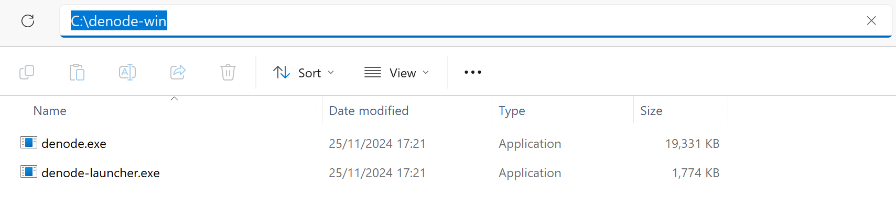
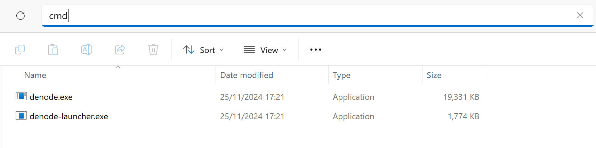
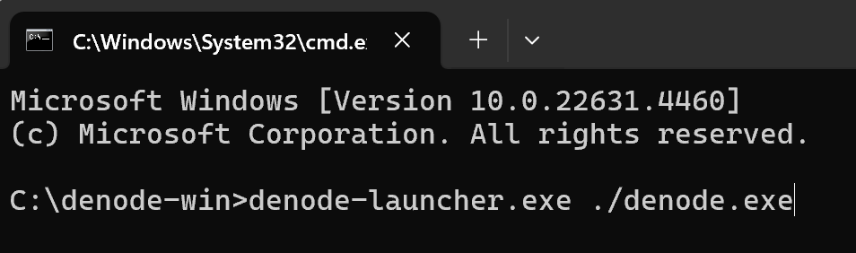

<p align="center">
    
</p>


<p align="center">
    Monetize your computer's storage now!
    <br/>
    <br/>
    <a href="https://denet.pro">
        
    </a> 
    <a href="https://t.me/+Yu5KnSruttc5ZGRi">
        
    </a> 
    <a href="https://discord.gg/cPz9m4cSWv">
        
    </a>
    <a href="https://www.youtube.com/channel/UCeCxt3tYbtSkJvaznNjQimQ">
        
    </a>
</p>

💽 **Datakeepers** offer their unused storage space to DeNet Storage users, creating a mutually beneficial conditions for all without any intermediaries. \
By utilizing the DeNet Storage Protocol, users pay for the storage they need, while Datakeepers are rewarded for the storage they provide.
#### 💰 [Calculate your potential reward](https://p.denet.app/datakeeper)

# Becoming Datakeeper: node set up instruction

### Table of contents:
- [Requirements](#requirements)
- [Step 1: Installation](#step-1-installation)
    - [Windows](#windows)
    - [Linux](#linuxmacosarmv6)
    - [ARMv6](#linuxmacosarmv6)
    - [MacOS](#linuxmacosarmv6)
- [Step 2: Configuration](#step-2-configuration)
- [Step 3: Becoming Online](#step-3-becoming-online)
- [FAQ](#faq)


## Requirements
💡 **Before setting up a node, make sure you meet all the requirements:**
- Public & static IP address
- At least 0.1 Polygon MATIC (in order to send proofs)
- 1GiB of RAM
- Stable internet connection, minimum speed - 20Mb/sec
- Provided free disk space > 512 GiB
- Operating system: Linux, MacOS, Windows (all x64)
- TBY balance ≥ your Datakeeper ID


## Step 1: Installation

### Windows

**1. Download latest release from [here](https://github.com/DeNetPRO/Node/releases/latest/download/denode-windows.zip)**

**2. Open containing folder, and extract archive to any location**

**3. Open that location using CMD**




**4. Run denode.exe using CMD**



-------------------
### Linux/MacOS/ARMv6

**1. Download binary using next command**

Using curl:
```
sh -c "$(curl -fsSL https://raw.githubusercontent.com/denetpro/node/master/scripts/install.sh)"
```
Using wget:
```
sh -c "$(wget  -O - https://raw.githubusercontent.com/denetpro/node/master/scripts/install.sh)"
```

**2. Launch denode binary**
```
denode
```
-------------------

## Step 2: Configuration

**Follow the instructions and configure your node:**
- Export Private key (we advise to create a new wallet address specifically to run DeNet Node)
- Set the password to protect your private key
- Enter your public IP address – you can simply Google “whats my ip” to determine this
- Port (from 10000 to 65535) or use default 55050 (press enter)
- Share disk (can be repeated with many disks)
    - Folder path of that you want to share
    - Size of the partition in GiB
- Choose the blockchain (currently only Polygon is supported)
    - Confirm selection of polygon **(press enter to use default)**
    - Select RPC – you can use a custom RPC or the default (https://polygon-rpc.com)
 
## Step 3: Becoming Online
To start receiving files from users and earning rewards, your computer needs to act as a server, which requires having a fixed IPv4 address through which it can be accessed.
You can own fixed IP in 2 ways: 

**Own fixed IP:**
Contact your ISP and request a fixed IP address. They may provide it for an additional fee or as part of a special plan for hosting servers or other services requiring a public IP. Once you have done that:
- Set up port forwarding on your router to direct incoming TCP traffic from the router's port to your local node's IP address and port.
- Ensure your firewall allows incoming connections for configured port.
- Restart denode.

**VPN port forwarding:**
- Setup a VPN with port forwarding function. You can use your own VPS server to configure VPN and forward connections, or you can find third-party VPN services with such features.
*Make sure that you’ve set correct IPv4 address and Port in your config.json*

Ask your questions here and get help:

<a href="https://t.me/+Yu5KnSruttc5ZGRi">
    
</a> 
<a href="https://discord.gg/cPz9m4cSWv">
    
</a>

## FAQ 

### Who is Datakeeper? ❓

▪ A Datakeeper launches a node in the DeNet network and provides storage space to users. It’s simple: Users pay for storage, Datakeepers are rewarded, no intermediaries (not even DeNet itself). 

### What is a Datakeeper ID ❓

▪ Datakeeper ID is your serial number in the network, obtained by making a TBY deposit. For example, if there are 10 Datakeepers, you need to deposit 11 TBY to take the next spot. 

### What data will I store ❓

▪ Actually, you will store only some encrypted file parts. Users can upload any kind of data through DeNet Storage, after files are split into 1MB parts, encrypted and distributed across the network. 

### Why is the Datakeeper ID price increasing with each new node ❓

▪ To send proofs and earn rewards, you need to have TBY balance ≥ your Datakeeper ID. It's crucial for ensuring network security: it prevents sudden exits of Datakeepers, potential attacks like the 51% or Sybil attacks, and ensures timely file replication. 

### Which drive is better to use (HDD, SSD, NVMe) ❓

▪️ There are no special requirements, but the faster your I/O speed, the more files you are able to store simultaneously and the higher rewards will be.

### Will my TBY deposit be spent ❓

▪️ No, the deposit amount remains the same and is only used to assert your ID.

### What is a node interception ❓

▪️ Note that in some cases, your ID may be intercepted or "stolen." This can occur if your TBY deposit is less than your Datakeeper ID, or if your node has been inactive for 30 days. Losing your Datakeeper ID will likely result in a higher cost to secure another spot, so it's crucial to monitor your TBY deposit and node activity closely.

### Can I run DeNet Node on a VPS  ❓

▪️ Yes, it is possible to run DeNode on a VPS. However, we recommend running the node on your own machine if it is your only purpose. If you have a PC or laptop with Linux or MacOS, obtaining a public IP from your ISP will be cheaper than using a VPS.

### What Internet speed do I need ❓

▪️ The minimum speed required is 20Mb/sec. However, higher and more stable internet speeds will provide better income opportunities.

### How much space should I share ❓

▪️ You can share as much space as you want. The more you allocate, the greater the potential rewards you can receive.

### How much can I earn monthly  ❓

Currently, there are 2 types of rewards for Datakeepers:

**1. Rewards for providing storage capacity and sending proofs of storage**

Visit https://p.denet.app/datakeeper and calculate your potential reward based on capacity you provide. Please note that the reward is relevant in case of fulfilling the capacity chosen. The amount of rewards depends on several factors, including storage capacity, network activity, and Max Loss Rate settings.

**Max Loss Rate:**
- This parameter determines the maximum acceptable loss ratio for Polygon network transactions when sending proofs.
- Higher Max Loss Rate allows larger proof rewards but increases transaction cost risks. It is determined by the condition: proof_reward_in_matic > tx_cost_in_matic / max_loss_rate.
Y- ou can learn more about Max Loss Rate and other reward factors in the [DeNet Consensus documentation](https://consensus.denet.app/onchain)

**2. Store&Earn program rewards**

S&E rewards are based on your TBY balance and completed tasks. Upon joining the Store&Earn program, Datakeepers get +4 to their Total Boost, which can significantly increase their rewards.

Visit https://beta.storeandearn.denet.app/ to calculate your potential reward based on your TBY balance.
